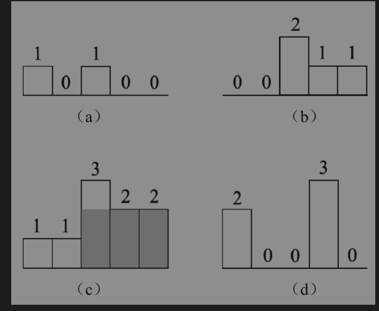

# [Largest Rectangle in Histogram][title]

## Description

## 思路
这道题难在将其和前面一道题联系起来, 如果逐行遍历矩阵, 是不是每一行和上面的 0 行构成的矩形就是前面一道题, 柱状图的最大面积了
对每一层的最大面积取最大值，得到的就是最大矩阵面积了. largestRectangleArea 复用了上道题逻辑。


```kotlin
class Solution {
    fun maximalRectangle(matrix: Array<CharArray>): Int {
        if (matrix.isEmpty()) return 0
        val row = matrix.size
        val col = matrix[0].size
        var res = 0
        val heights = IntArray(col)
        for (row in matrix) {
            for (i in row.indices) {
                if (row[i] == '0') {
                    heights[i] = 0
                } else {
                    heights[i]++
                }
            }
            res = max(res, largestRectangleArea(heights))
        }
        return res
    }

    private fun largestRectangleArea(heights: IntArray): Int {
        val stack = ArrayDeque<Int>()
        stack.add(-1)
        // 计算以每个柱子为顶的矩形面积
        var maxArea = 0
        for (i in heights.indices) {
            while (stack.last() != -1 && heights[stack.last()] >= heights[i]) {
                val height = heights[stack.removeLast()]
                val width = i - stack.last() - 1
                maxArea = max(maxArea, height * width)
            }
            stack.add(i)
        }
        while (stack.last() != -1) {
            val height = heights[stack.removeLast()]
            val width = heights.size - stack.last() - 1
            maxArea = max(maxArea, height * width)
        }
        return maxArea
    }

}
```


## 结语

如果你同我一样热爱数据结构、算法、LeetCode，可以关注我 GitHub 上的 LeetCode 题解：[awesome-java-leetcode][ajl]


[title]: https://leetcode.cn/problems/largest-rectangle-in-histogram/description/
[ajl]: https://github.com/Blankj/awesome-java-leetcode
