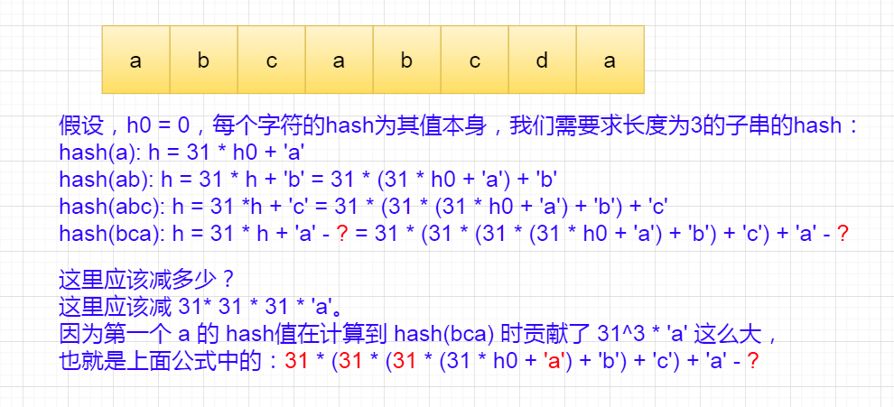

# [Longest Duplicate Substring][title]


## Solution
二分查找 + 自定义哈希
给定字符串为 "abcabcdd"，长度为8，先试下长度为 4 的有没有重复子串，没有，对不对，再试下长度为 2 的有没有重复子串，有重复子串 "ab" 或者 "bc" 但不是最长的，然后再试下长度为 3 的有没有重复子串，正好也有，那最长的应该改成是长度为 3 的那个重复子串，也就是 "abc"。

如何自定义哈希？

其实，我们可以参考 Java 中 hashCode() 方法结合滑动窗口来写，问题在于，当滑动窗口往前移动的时候，如何把之前计算过的字母的 hash 值去掉, 请看图解：


此外就是留意 left == right 也是需要访问的， 不然会漏解

Time Complexity: O(n*logn)
Spcace Complexity: O(n)

```kotlin
class Solution {
    fun longestDupSubstring(s: String): String {
        var res = ""
        var left = 0
        var right = s.length
        while (left <= right) {
            val mid = (left + right) / 2
            val x = find(s, mid)
            if (x.isNotEmpty()) {
                res = x
                left = mid + 1
            } else {
                right = mid - 1
            }
        }
        return res
    }

    private fun find(s: String, len: Int): String {
        var power = 1L
        var hash = 0L
        for (i in 0..<len) {
            hash = hash * PRIME + s[i].code
            power *= PRIME
        }
        val set = mutableSetOf(hash)
        for (i in len..<s.length) {
            hash = hash * PRIME + s[i].code - (power * s[i - len].code)
            if (hash in set) {
                // 如果包含相同的hash说明之前可能出现过相同的子串
                // 再检测一下从头查找相同的子串，它的位置不是当前 i 的位置，说明确实是相同的子串
                // 否则，可能是因为hash冲突导致的误判
                // 针对本题，不加indexOf这个判断也可以过，是因为没有出现这样的用例
                // 但是，为了逻辑更严谨，还是应该加上这个判断
                val res = s.substring(i - len + 1, i + 1)
                if (s.indexOf(res) != i) {
                    return res
                }
            }
            set.add(hash)
        }
        return ""
    }

    companion object {
        const val PRIME = 31
    }
}
```

## Conclusion

如果你同我一样热爱数据结构、算法、LeetCode，可以关注我 GitHub 上的 LeetCode 题解：[awesome-kotlin-leetcode][akl]


[title]: https://leetcode.cn/problems/longest-duplicate-substring/description/

[akl]: https://github.com/NightXlt/awesome-kotlin-leetcode
