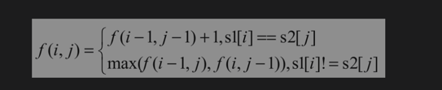

# [Longest Common Subsequence][title]

双序列问题的输入有两个或更多的序列，通常是两个字符串或数组。
由于输入是两个序列，因此状态转移方程通常有两个参数，即f（i，j），定义第1个序列中下标从0到i的子序列和第2个序列中下标从0到j的子序列的最优解（或解的个数）。
一旦找到了 f（i，j）与 f（i-1，j-1）、 f（i-1，j） 和 f（i，j-1）的关系，通常问题也就迎刃而解。

## Solution
用函数f（i，j）表示第1个字符串中下标从0到i的子字符串（记为s1[0..i]）和第2个字符串中下标从0到j的子字符串（记为s2[0..j]）的最长公共子序列的长度。
如果第1个字符串的长度是m，第2个字符串的长度是n，那么f（m-1，n-1）就是整个问题的解。

如果第1个字符串中下标为i的字符（记为s1[i]）与第2个字符串中下标为 j（记为 s2[j]）的字符相同，那么f（i，j）相当于在s1[0..i-1]和s2[0..j-1]的最长公共子序列的后面添加一个公共字符，也就是 f（i，j）=f（i-1，j-1）+1。
如果字符s1[i]与字符s2[j]不相同，则这两个字符不可能同时出现在s1[0..i]和s2[0..j]的公共子序列中。
此时s1[0..i]和s2[0..j]的最长公共子序列要么是s1[0..i-1]和s2[0..j]的最长公共子序列，要么是s1[0..i]和s2[0..j-1]的最长公共子序列。也就是说，
f（i，j）= f（i-1，j）和f（i，j-1）的最大值。


此外这里有个通用的处理技巧，在很多双序列问题中都用到了， 面试中应该也会提到，因为转移方程存在 i - 1, j - 1 的情况， 

当 i - 1 时，会出现越界，我们将二维数组整体扩大一行一列， 变为 （s.length + 1） 和 （t.length +1）

巧妙的解了可能的越界问题。当然 dp 的含义由原先 dp[i][j] 的 [0..i] 与 [0..j] 的公共子序列长度变为了 dp[i + 1][j + 1] 来表述了。

此外双序列题目和单序列我们需要考虑初始化的情况，在这道题目中对应的就是 
dp[0][j] 和 dp[i][0] 的情况，当其中一方为空串的情况下， 那么必然不存在公共子串， dp[i][0], dp[0][j] = 0

下面的写法有点抽象哈， 因为已经优化过空间复杂度了，因为 dp[i + 1][j + 1] 只取决于左上角，正上方，左侧的元素
我们可以用两行就可以完成这个模拟过程。

```kotlin
import kotlin.math.max

class Solution {
    fun longestCommonSubsequence(text1: String, text2: String): Int {
        val len1 = text1.length
        val len2 = text2.length
        if (len1 < len2) {
            return longestCommonSubsequence(text2, text1)
        }
        val dp = Array<IntArray>(2) { IntArray(len2 + 1) }
        for (i in text1.indices) {
            for (j in text2.indices) {
                if (text1[i] == text2[j]) {
                    dp[(i + 1) % 2][j + 1] = dp[i % 2][j] + 1
                } else {
                    dp[(i + 1) % 2][j + 1] = max(dp[i % 2][j + 1], dp[(i + 1) % 2][j])
                }
            }
        }
        return dp[len1 % 2][len2]
    }
}
```

之前第一遍写的时候想的不是很明白怎么把两行压缩成了单行， 后面再写时想明白了。
单行的话， 最难想通的点是 dp[i - 1][j - 1] 咋记录啊， 当我访问到 dp[i][j] 时， dp[i - 1][j - 1] 已经被更新为了 dp[i][j - 1] 的情况了。
看了代码理解的一点是，我们用一个变量暂存 dp[i-1][j-1] 的值就好， 每次更新当前 dp[j + 1] 为 cur 时， 同时提前更新 prev 为 dp[j + 1]。

```kotlin

class Solution {
    fun longestCommonSubsequence(text1: String, text2: String): Int {
        val length1 = text1.length
        val length2 = text2.length
        if (length1 < length2) {
            return longestCommonSubsequence(text2, text1)
        }
        val dp = IntArray(length2 + 1)
        for (i in text1.indices) {
            var prev = dp[0]
            for (j in text2.indices) {
                val cur = if (text1[i] == text2[j]) {
                    prev + 1 
                } else {
                    max(dp[j], dp[j + 1])
                }
                prev = dp[j + 1]
                dp[j + 1] = cur
            }
        }
        return dp.last()
    }
}
```
## Conclusion

如果你同我一样热爱数据结构、算法、LeetCode，可以关注我 GitHub 上的 LeetCode 题解：[awesome-kotlin-leetcode][akl]


[title]: https://leetcode.cn/problems/longest-common-subsequence/description/
[akl]: https://github.com/NightXlt/awesome-kotlin-leetcode
