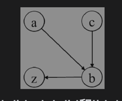

# [Alien Dictionary][title]

There is a new alien language that uses the English alphabet. However, the order of the letters is unknown to you.

You are given a list of strings words from the alien language's dictionary. Now it is claimed that the strings in words are
sorted lexicographically by the rules of this new language.

If this claim is incorrect, and the given arrangement of string in words cannot correspond to any order of letters, return "".

Otherwise, return a string of the unique letters in the new alien language sorted in lexicographically increasing order by the new language's rules. If there are multiple solutions, return any of them.

Example 1:
```text
Input: words = ["wrt","wrf","er","ett","rftt"]
Output: "wertf"
```

Example 2:
```text
Input: words = ["z","x"]
Output: "zx"
```

Example 3:
```text
Input: words = ["z","x","z"]
Output: ""
Explanation: The order is invalid, so return "".
```

## Solution
在排序的单词列表["ac"，"ab"，"bc"，"zc"，"zb"]中，一共出现了4个字母， 即'a'、'b'、'c'和'z'。
需要根据单词的顺序确定这个4个字母的顺序。由于"ac"排在"ab"的前面，因此字母'c'应该排在字母'b'的前面（即'c'＜'b'）。这是因为这两个单词的第1个字母相同，第2个字母不同，那么它们的第2个字母的顺序确定了两个单词的顺序。接下来两个相邻的单词是"ab"和"bc"，它们的第1个字母就不同，那么它们的顺序由它们的第1个字母确定，所以'a'＜'b'。类似地，可以根据"bc"排在"zc"的前面得知'b'＜'z'，根据"zc"排在"zb"的前面得知'c'＜'b'。由比较排序的单词列表中两两相邻的单词可知'c'＜'b'、'a'＜'b'和'b'＜'z'，现在需要找出一个包含4个字母的字母序列满足已知的3个字母的大小顺序。这看起来就是一个关于拓扑排序的问题，可以将每个字母看成图中的一个节点。如果已知两个字母的大小关系，那么图中就有一条从较小的字母指向较大的字母的边。根据字母的大小关系'c'＜'b'、'a'＜'b'和'b'＜'z' 构建出的有向图如图所示，



如果能够得出该有向图的拓扑排序序列，那么任意一条边的起始节点（较小的字母）在拓扑排序序列中一定出现在终止节点（较大的字母）的前面。因此，这个问题实质上一个关于拓扑排序的问题。
如果最终我们得到的排序节点长度 = 字母长度， 那么说明没有环， 否则则存在环。

留意一种题目情况， 满足 sorted lexicographically， 字典序排序。

那么肯定 star 不应该排在 start 后面. 换言之合理的顺序应该是 star, start.

如果检测到 start 排在了 star 前面， 那么可以直接返回不满足了。这算是逻辑剪枝。

```kotlin
class Solution {
    fun alienOrder(words: Array<String>): String {
        if (words.isEmpty()) return ""
        // graph stores outDegree's chars(value) of char(key)
        val graph = mutableMapOf<Char, MutableSet<Char>>()
        val inDegrees = mutableMapOf<Char, Int>()
        initGraph(words, graph, inDegrees)
        for (i in 1 until words.size) {
            val w1 = words[i - 1]
            val w2 = words[i]
            // 如果 sta 排在了 star 前面肯定是有问题的， 直接返回空串。
            if (w1.startsWith(w2) && w1 != w2) return ""
            var j = 0
            while (j < w1.length && j < w2.length) {
                val c1 = w1[j]
                val c2 = w2[j]
                if (c1 != c2) {
                    if (!graph[c1]!!.contains(c2)) {
                        graph[c1]!!.add(c2)
                        inDegrees[c2] = inDegrees[c2]!! + 1
                    }
                    break
                }
                j++
            }
        }
        val builder = bfs(inDegrees, graph)
        return if (builder.length == graph.size) builder.toString() else ""
    }

    private fun initGraph(
        words: Array<String>,
        graph: MutableMap<Char, MutableSet<Char>>,
        inDegrees: MutableMap<Char, Int>
    ) {
        for (word in words) {
            for (c in word.toCharArray()) {
                graph.putIfAbsent(c, mutableSetOf())
                inDegrees.putIfAbsent(c, 0)
            }
        }
    }

    private fun bfs(
        inDegrees: MutableMap<Char, Int>,
        graph: MutableMap<Char, MutableSet<Char>>
    ): StringBuilder {
        val queue = ArrayDeque<Char>()
        queue.addAll(inDegrees.keys.filter { inDegrees[it] == 0 })
        val builder = StringBuilder()
        while (queue.isNotEmpty()) {
            val ch = queue.removeFirst()
            builder.append(ch)
            for (neighbor in graph[ch]!!) {
                inDegrees[neighbor] = inDegrees[neighbor]!! - 1
                if (inDegrees[neighbor] == 0) {
                    queue.add(neighbor)
                }
            }
        }
        return builder
    }
}

```

## Conclusion
如果你同我一样热爱数据结构、算法、LeetCode，可以关注我 GitHub 上的 LeetCode 题解：[awesome-kotlin-leetcode][akl]

[title]: https://leetcode.cn/problems/alien-dictionary/
[akl]: https://github.com/NightXlt/awesome-kotlin-leetcode
