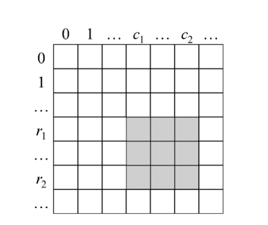

# Range Sum Query 2D - Immutable][title]

## Description

Given a 2D matrix matrix, handle multiple queries of the following type:

Calculate the sum of the elements of matrix inside the rectangle defined by its upper left corner (row1, col1) and lower
right corner (row2, col2).
Implement the NumMatrix class:

NumMatrix(int[][] matrix) Initializes the object with the integer matrix matrix.
int sumRegion(int row1, int col1, int row2, int col2) Returns the sum of the elements of matrix inside the rectangle
defined by its upper left corner (row1, col1) and lower right corner (row2, col2).
You must design an algorithm where sumRegion works on O(1) time complexity.

**Example 1:**

```
["NumMatrix", "sumRegion", "sumRegion", "sumRegion"]
[[[[3, 0, 1, 4, 2], [5, 6, 3, 2, 1], [1, 2, 0, 1, 5], [4, 1, 0, 1, 7], [1, 0, 3, 0, 5]]], [2, 1, 4, 3], [1, 1, 2, 2], [1, 2, 2, 4]]
```

**Example 2:**

```
NumMatrix numMatrix = new NumMatrix([[3, 0, 1, 4, 2], [5, 6, 3, 2, 1], [1, 2, 0, 1, 5], [4, 1, 0, 1, 7], [1, 0, 3, 0, 5]]);
numMatrix.sumRegion(2, 1, 4, 3); // return 8 (i.e sum of the red rectangle)
numMatrix.sumRegion(1, 1, 2, 2); // return 11 (i.e sum of the green rectangle)
numMatrix.sumRegion(1, 2, 2, 4); // return 12 (i.e sum of the blue rectangle)
```

## 思路

对于一个二维矩阵，可能由于输入不同的坐标而反复求不同子矩阵的数字之和，这说明应该优化求和的过程，要尽可能快地实现子矩阵的数字求和。

如果仔细分析子矩阵的数字之和的规律，就可以发现左上角坐标为（r1，c1）、右下角坐标为（r2，c2）的子矩阵的数字之和可以用4个左上角坐标为（0，0）的子矩阵的数字之和求得。
图中的阴影部分表示左上角坐标为（r1，c1）、右下角坐标为（r2，c2）的子矩阵。该子矩阵的数字之和等于左上角坐标为（0，0）、右下角坐标为（r2，c2）的子矩阵的数字之和减去左上角坐标为（0，0）、右下角坐标为（r1-1，c2）的子矩阵的数字之和，再减去左上角坐标为（0，0）、右下角坐标为（r2，c1-1）的子矩阵的数字之和，最后加上左上角坐标为（0，0）、右下角坐标为（r1-1，c1-1）的子矩阵的数字之和。


可以在预处理阶段求出从左上角坐标为（0，0）到每个右下角坐标的子矩阵的数字之和。首先创建一个和输入矩阵大小相同的辅助矩阵sums，该矩阵中的坐标（i，j）的数值为输入矩阵中从左上角坐标（0，0）到右下角坐标（i，j）的子矩阵的数字之和。有了这个辅助矩阵sums，再求左上角坐标为（r1，c1）、右下角坐标为（r2，c2）的子矩阵的数字之和就变得比较容易。该子矩阵的数字之和等于sums[r2][c2]
+sums[r1-1][c2]-sums[r2][c1-1]+sums[r1-1][c1-1]。

下面分析如何生成辅助矩阵sums，即求得数组中的每个数字sums[i][j]。按照生成辅助矩阵sums的规则，sums[i][j]
的值等于输入矩阵中从左上角坐标为（0，0）到右下角坐标为（i，j）的子矩阵的数字之和。

可以把从左上角坐标为（0，0）到右下角坐标为（i，j）的子矩阵的数字看成由两部分组成。第1部分是从左上角坐标为（0，0）到右下角坐标为（i-1，j）的子矩阵，该子矩阵的数字之和等于sums[i-1][j]
。第2部分是输入矩阵中第i行中列号从0到j的所有数字。如果按照从左到右的顺序计算sums[i][j]，则可以逐个累加第i行的数字，从而得到子矩阵第2部分的数字之和。

sum[i][j] = sum[i - 1][j] + rowSum. 但当 i=0 时, i - 1 =-1 是非法下标. 通过把 sum[i][j] 变为 sum[i + 1][j + 1], 表达的含义不变, 从左上角坐标为（0，0）到右下角坐标为（i，j）的矩阵和

```kotlin
class NumMatrix(matrix: Array<IntArray>) {

    val sum = Array(matrix.size + 1) { IntArray(matrix[0].size + 1) }

    init {

        for (i in matrix.indices) {
            var rowSum = 0
            for (j in matrix[0].indices) {
                rowSum += matrix[i][j]
                sum[i + 1][j + 1] = sum[i][j + 1] + rowSum
            }
        }
    }

    // 画图减去前缀和叠加部分， 注意左上角的点移动是因为考虑到矩阵第一行需要保留，
    // 因此整体左上角偏移了一格
    fun sumRegion(row1: Int, col1: Int, row2: Int, col2: Int): Int {
        return sum[row2 + 1][col2 + 1] + sum[row1][col1] -
                sum[row2 + 1][col1] - sum[row1][col2 + 1]
    }

}

```

## 结语

如果你同我一样热爱数据结构、算法、LeetCode，可以关注我 GitHub 上的 LeetCode 题解：[awesome-java-leetcode][ajl]


[title]: https://leetcode.cn/problems/range-sum-query-2d-immutable/

[ajl]: https://github.com/Blankj/awesome-java-leetcode
