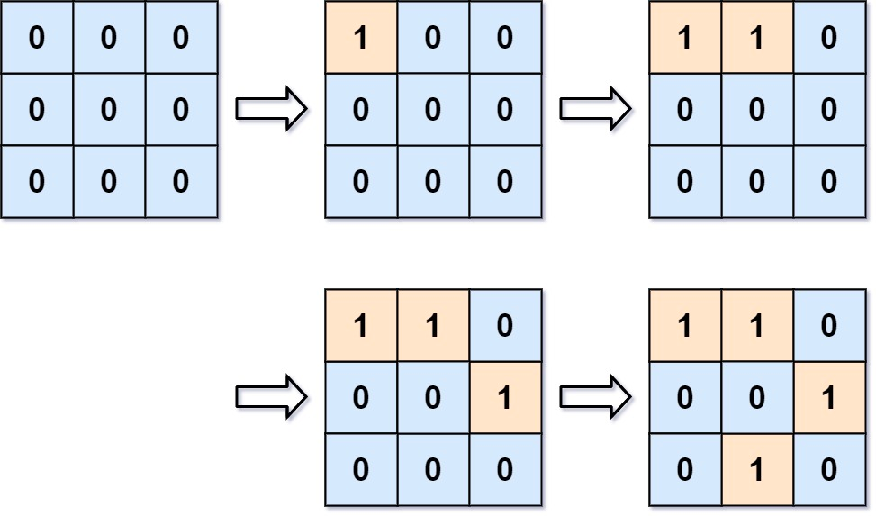

# [Number of Islands II][title]

## Description
You are given an empty 2D binary grid grid of size m x n. The grid represents a map where 0's represent water and 1's represent land. Initially, all the cells of grid are water cells (i.e., all the cells are 0's).

We may perform an add land operation which turns the water at position into a land. You are given an array positions where positions[i] = [ri, ci] is the position (ri, ci) at which we should operate the ith operation.

Return an array of integers answer where answer[i] is the number of islands after turning the cell (ri, ci) into a land.

An island is surrounded by water and is formed by connecting adjacent lands horizontally or vertically. You may assume all four edges of the grid are all surrounded by water.

Example 1:



Input: m = 3, n = 3, positions = [[0,0],[0,1],[1,2],[2,1]]
Output: [1,1,2,3]
Explanation:
Initially, the 2d grid is filled with water.
- Operation #1: addLand(0, 0) turns the water at grid[0][0] into a land. We have 1 island.
- Operation #2: addLand(0, 1) turns the water at grid[0][1] into a land. We still have 1 island.
- Operation #3: addLand(1, 2) turns the water at grid[1][2] into a land. We have 2 islands.
- Operation #4: addLand(2, 1) turns the water at grid[2][1] into a land. We have 3 islands.

## 思路
通过并查集记录同一个根的岛屿， 每次加入时， 先把 count + 1，如果发生 merge，再进行 count 减一。
如果当前节点之前已经变为岛屿的话， 就无需进行逻辑处理， 直接添加当前的 count 进入到 res 中。

merge 的前置条件是：
1. 当前索引合法 
2. 当前节点的邻居节点之前已经是岛屿了
3. 这两个岛屿之前没有进行过 merge, 如果进行过 merge 再做 count - 1, count 就会多减了 

我们用一个 visited 记录当前为岛屿的 index. index = row * n + col 得到 id. id 也会用在并查集的编号上。

```kotlin
class Solution {

    val dirs = arrayOf(
        intArrayOf(0, 1),
        intArrayOf(0, -1),
        intArrayOf(-1, 0),
        intArrayOf(1, 0),
    )

    fun numIslands2(m: Int, n: Int, positions: Array<IntArray>): List<Int> {
        if (positions.isEmpty()) return emptyList()
        val res = mutableListOf<Int>()
        val unionFind = UnionFind(m * n)
        val visited = BooleanArray(m * n)
        for ((row, col) in positions) {
            val index = row * n + col
            if (visited[index]) { // 当前节点之前已经变为岛屿的话， 就无需进行逻辑处理， 直接添加当前的 count 进入到 res 中。
                res.add(unionFind.count)
                continue
            }
            visited[index] = true
            unionFind.addCount()
            for ((rowDiff, colDiff) in dirs) {
                val newRow = row + rowDiff
                val newCol = col + colDiff
                val newIndex = newRow * n + newCol
                if (isValidIndex(newRow, newCol, m, n)
                    && visited[newIndex]
                    && !unionFind.isConnected(index, newIndex)
                ) {
                    unionFind.union(index, newIndex)
                }
            }
            res.add(unionFind.count)
        }
        return res
    }

    private fun isValidIndex(row: Int, col: Int, m: Int, n: Int): Boolean {
        return row in 0..<m && col in 0..<n
    }

    class UnionFind(size: Int) {

        private val find = IntArray(size) { it }
        var count = 0

        fun addCount() {
            count++
        }

        fun find(x: Int): Int {
            if (x != find[x]) {
                return find(find[x])
            }
            return find[x]
        }

        fun isConnected(x: Int, y: Int): Boolean {
            return find(x) == find(y)
        }

        fun union(x: Int, y: Int) {
            val fx = find(x)
            val fy = find(y)
            if (fx == fy) return
            find[fx] = fy
            count--
        }
    }
}

```


## 结语

如果你同我一样热爱数据结构、算法、LeetCode，可以关注我 GitHub 上的 LeetCode 题解：[awesome-java-leetcode][ajl]


[title]: https://leetcode.cn/problems/number-of-islands-ii/description/
[ajl]: https://github.com/Blankj/awesome-java-leetcode
