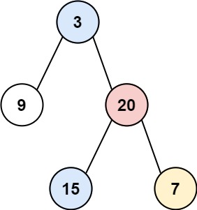
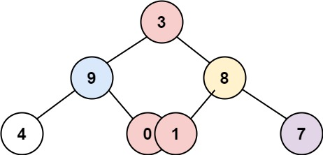

# [Binary Tree Vertical Order Traversal][title]

## Description

Given the root of a binary tree, return the vertical order traversal of its nodes' values. (i.e., from top to bottom, column by column).

If two nodes are in the same row and column, the order should be from left to right.


**Example:**



```
Input: root = [3,9,20,null,null,15,7]
Output: [[9],[3,15],[20],[7]]
```



```
Input: root = [3,9,8,4,0,1,7]
Output: [[4],[9],[3,0,1],[8],[7]]
```

## Solution
BFS 遍历树， 再用一个 hashMap 存储当前 column 和 value 的对应关系。
每遍历到一个 node 时更新到 map 中，针对下一层的 left, right。
分别将 （left, col - 1） 和 （right, col + 1）的 pair 加入到 queue 中。
同时在遍历过程中记录最左侧的 column 和 最右侧的 column, 避免了访问结束后对 map 进行排序的耗时。

T: O(N)
S: O(N)

```kotlin
class Solution {
    fun verticalOrder(root: TreeNode?): List<List<Int>> {
        root ?: return emptyList()
        val queue = ArrayDeque<Pair<TreeNode, Int>>()
        val columnMap = mutableMapOf<Int, MutableList<Int>>()
        val result = mutableListOf<List<Int>>()
        queue.add(root to 0)
        var minColumn = Int.MAX_VALUE
        var maxColumn = Int.MIN_VALUE
        while (queue.isNotEmpty()) {
            val (node, col) = queue.removeFirst()
            columnMap.getOrPut(col) { mutableListOf() }.add(node.`val`)
            node.left?.apply { queue.add(this to col - 1) }
            node.right?.apply { queue.add(this to col + 1) }
            minColumn = min(minColumn, col)
            maxColumn = max(maxColumn, col)
        }

        for (i in minColumn..maxColumn) {
            result.add(columnMap.getValue(i))
        }
        return result
    }
}

```


## 结语

如果你同我一样热爱数据结构、算法、LeetCode，可以关注我 GitHub 上的 LeetCode 题解：[awesome-java-leetcode][ajl]


[title]: https://leetcode.cn/problems/binary-tree-vertical-order-traversal/description/?company_slug=facebook
[ajl]: https://github.com/Blankj/awesome-java-leetcode
