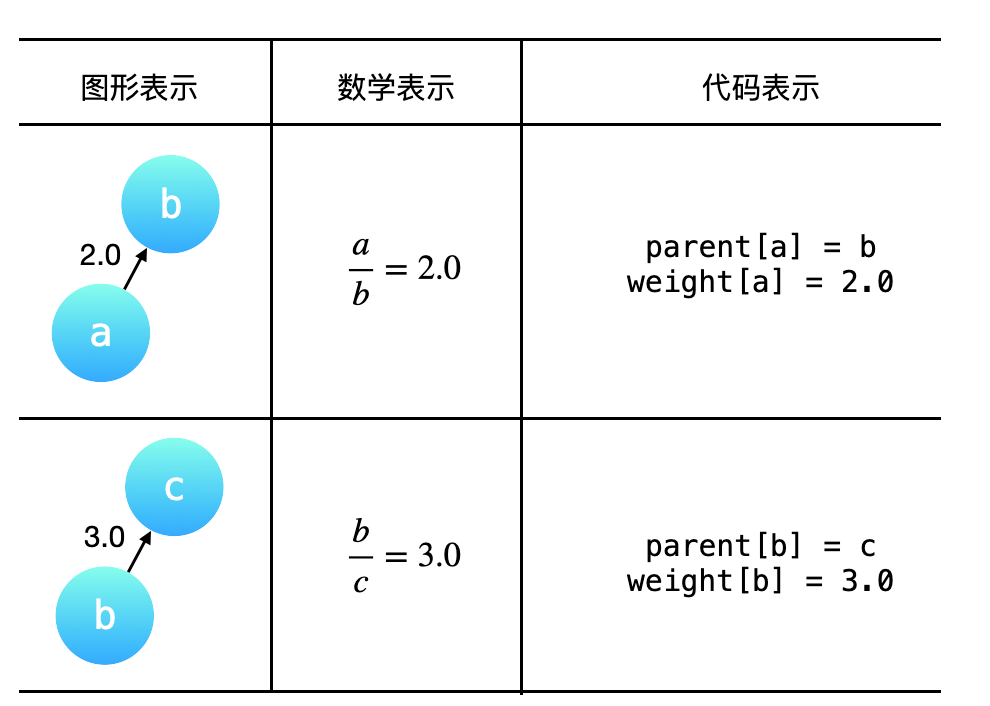
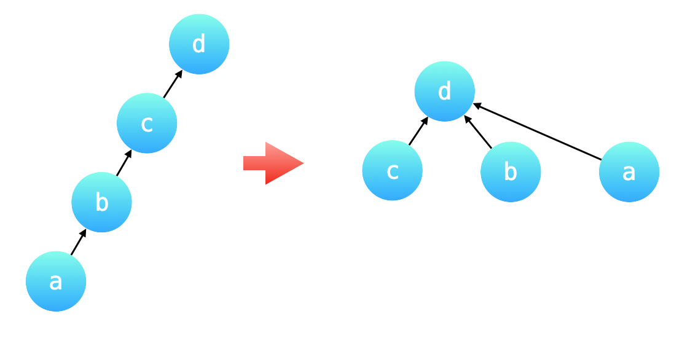
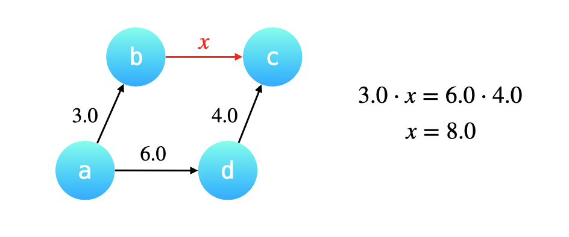

# [Evaluate Division][title]

You are given an array of variable pairs equations and an array of real numbers values, where equations[i] = [Ai, Bi] and values[i] represent the equation Ai / Bi = values[i]. Each Ai or Bi is a string that represents a single variable.

You are also given some queries, where queries[j] = [Cj, Dj] represents the jth query where you must find the answer for Cj / Dj = ?.

Return the answers to all queries. If a single answer cannot be determined, return -1.0.

Note: The input is always valid. You may assume that evaluating the queries will not result in division by zero and that there is no contradiction.

Note: The variables that do not occur in the list of equations are undefined, so the answer cannot be determined for them.

Example 1:
```text
Input: equations = [["a","b"],["b","c"]], values = [2.0,3.0], queries = [["a","c"],["b","a"],["a","e"],["a","a"],["x","x"]]
Output: [6.00000,0.50000,-1.00000,1.00000,-1.00000]
Explanation:
Given: a / b = 2.0, b / c = 3.0
queries are: a / c = ?, b / a = ?, a / e = ?, a / a = ?, x / x = ?
return: [6.0, 0.5, -1.0, 1.0, -1.0 ]
note: x is undefined => -1.0
```

Example 2:
```text
Input: equations = [["a","b"],["b","c"],["bc","cd"]], values = [1.5,2.5,5.0], queries = [["a","c"],["c","b"],["bc","cd"],["cd","bc"]]
Output: [3.75000,0.40000,5.00000,0.20000]
```

## Solution
变量之间的倍数关系具有传递性，处理有传递性关系的问题，可以使用「并查集」，我们需要在并查集的「合并」与「查询」操作中 维护这些变量之间的倍数关系。

equations 和 values 可以表示成一个图，
equations 中出现的变量就是图的顶点，「分子」于「分母」的比值可以表示成一个有向关系（因为「分子」和「分母」是有序的，不可以对换），并且这个图是一个带权图，values 就是对应的有向边的权值。例 1 中给出的 equations 和 values 表示的「图形表示」、「数学表示」和「代码表示」如下表所示。其中 parent[a] = b 表示：结点 a 的（直接）父亲结点是 b，与之对应的有向边的权重，记为 weight[a] = 2.0，
即 weight[a] 表示结点 a 到它的 直接父亲结点 的有向边的权重。


为了避免并查集所表示的树形结构高度过高，影响查询性能。「路径压缩」就是针对树的高度的优化。

「路径压缩」的效果是：在查询一个结点 a 的根结点同时，把结点 a 到根结点的沿途所有结点的父亲结点都指向根结点。

如下图所示，除了根结点以外，所有的结点的父亲结点都指向了根结点。

特别地，也可以认为根结点的父亲结点就是根结点自己。

如下图所示：路径压缩前后，并查集所表示的两棵树形结构等价，路径压缩以后的树的高度为 2，查询性能最好。


在结点 a 执行一次「查询」操作。路径压缩会先一层一层向上先找到根结点 d，然后依次把 c、b 、a 的父亲结点指向根结点 d。

c 的父亲结点已经是根结点了，它的权值不用更改；
b 的父亲结点要修改成根结点，它的权值就是从当前结点到根结点经过的所有有向边的权值的乘积，因此是 3.0 乘以 4.0 也就是 12.0；
a 的父亲结点要修改成根结点，它的权值就是依然是从当前结点到根结点经过的所有有向边的权值的乘积，但是我们 没有必要把这三条有向边的权值乘起来，这是因为 b 到 c，c 到 d 这两条有向边的权值的乘积，我们在把 b 指向 d 的时候已经计算出来了。因此，a 到根结点的权值就等于 b 到根结点 d 的新的权值乘以 a 到 b 的原来的有向边的权值。


如何在「合并」操作中维护权值的变化
「合并」操作基于这样一个 很重要的前提：我们将要合并的两棵树的高度最多为 222，换句话说两棵树都必需是「路径压缩」以后的效果，两棵树的叶子结点到根结点最多只需要经过一条有向边。

例如已知 a/b=3.0  d/c=4.0  又已知 a/d=6.0，现在合并结点 a 和 d 所在的集合，其实就是把 a 的根结点 b 指向 d 的根结点 c，那么如何计算 b 指向 c 的这条有向边的权重呢？

根据 a 经过 b 可以到达 c，a 经过 d 也可以到达 c，因此 两条路径上的有向边的权值的乘积是一定相等的。设 b 到 c 的权值为 x，那么 3.0*x = 6.0*4.0; x=8



```kotlin
class Solution {
    fun calcEquation(
        equations: List<List<String>>,
        values: DoubleArray,
        queries: List<List<String>>
    ): DoubleArray {
        val equationsSize: Int = equations.size
        // 二倍的原因是每条边有两个元素, 尽管会有浪费但可以接受吧
        val unionFind = UnionFind(2 * equationsSize)
        val map = HashMap<String, Int>(2 * equationsSize)
        var id = 0
        // 第 1 步：预处理，将变量的值与 id 进行映射，使得并查集的底层使用数组实现，方便编码
        for (i in 0 until equationsSize) {
            val equation = equations[i]
            val (dividend, divisor) = equation
            if (dividend !in map) {
                map[dividend] = id
                id++
            }
            if (divisor !in map) {
                map[divisor] = id
                id++
            }
            unionFind.union(map[dividend]!!, map[divisor]!!, values[i])
        }
        // 第 2 步：做查询
        val res = DoubleArray(queries.size)
        for (i in queries.indices) {
            val (dividend, divisor) = queries[i]
            val id1 = map[dividend]
            val id2 = map[divisor]
            if (id1 == null || id2 == null) {
                res[i] = -1.0
                continue
            }
            res[i] = unionFind.calWeight(id1, id2)
        }
        return res
    }
}

private class UnionFind(n: Int) {
    var find = IntArray(n) { it }
    var weights = DoubleArray(n) { 1.0 }

    // 合并过程中需要进行权值计算
    fun union(x: Int, y: Int, weight: Double) {
        val fx = find(x)
        val fy = find(y)
        if (fx == fy) return
        find[fx] = fy
        weights[fx] = weights[y] * weight / weights[x]
    }

    // 路径压缩, 拍平所有节点都指向 root
    fun find(x: Int): Int {
        if (x != find[x]) {
            val originParentNode = find[x]
            find[x] = find(find[x])
            // 计算当前节点的权值时, 父亲的节点都已经直接指向了根节点, 且更新权值结束. 我只需要 * 到父亲的权值就好了
            weights[x] *= weights[originParentNode] 
        }

        return find[x]
    }

    fun calWeight(x: Int, y: Int): Double {
        val fx = find(x);
        val fy = find(y);
        return if (fx == fy) {
            weights[x] / weights[y]
        } else {
            -1.0
        }
    }
}
```

## Conclusion
如果你同我一样热爱数据结构、算法、LeetCode，可以关注我 GitHub 上的 LeetCode 题解：[awesome-kotlin-leetcode][akl]


[title]: https://leetcode.cn/problems/evaluate-division/
[akl]: https://github.com/NightXlt/awesome-kotlin-leetcode
