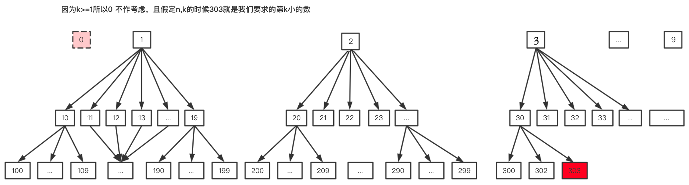

# [K-th Smallest in Lexicographical Order][title]

## Solution
这道题如果想暴力枚举字典序 + 堆排序的话，大数据量下会超时。

可以借鉴前缀树的思想， 构建九颗十叉树，根是 （1..9）如下图所示


我们通过前序遍历第一颗树， 依次添加直至树中的节点的值 > n, 这时再去右边节点的树重复做改操作，
直到我们访问到了第 k 个节点。
要记录当前访问的值不超过 n, 我们通过 cur 来记录当前的值，因为第一个必然是 1， 我们以其作为初始值后， 
k 记录当前未找到的个数，其减为 0 时表示找到第 k 小的元素了

```kotlin
class Solution {
    fun findKthNumber(n: Int, k: Int): Int {
        var cur = 1 // 表示当前访问的节点的值
        var k = k - 1
        while (k > 0) {
            val count = getNodes(n, cur) // 得到当前节点树中小于 n 的节点个数
            if (k >= count) { // k 大于这个个数， 直接 go right， 减去这部分的节点
                k -= count
                cur += 1
            } else { // go down
                k -= 1
                cur *= 10
            }
        }
        return cur
    }

    private fun getNodes(n: Int, cur: Int): Int {
        var next: Long = cur + 1L
        var totalNodes = 0L
        var cur = cur.toLong()
        while (cur <= n) {
            totalNodes += min(n - cur + 1, next - cur)
            next *= 10
            cur *= 10
        }
        return totalNodes.toInt()
    }
}

```
## Conclusion

如果你同我一样热爱数据结构、算法、LeetCode，可以关注我 GitHub 上的 LeetCode 题解：[awesome-kotlin-leetcode][akl]


[title]: https://leetcode-cn.com/problems/check-if-there-is-a-valid-path-in-a-grid/
[akl]: https://github.com/NightXlt/awesome-kotlin-leetcode
