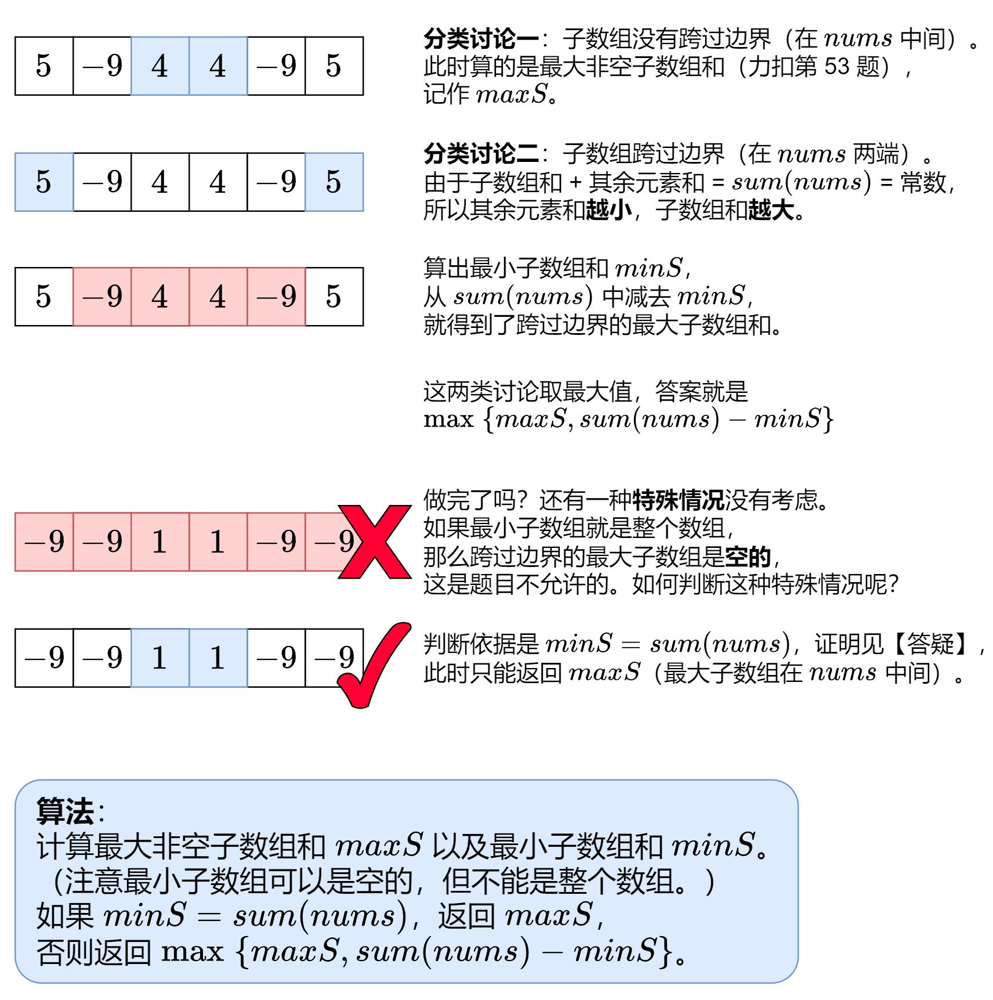

# [Maximum Sum Circular Subarray][title]

## 思路

参考了下別人的[題解](https://leetcode.cn/problems/maximum-sum-circular-subarray/solutions/2351107/mei-you-si-lu-yi-zhang-tu-miao-dong-pyth-ilqh/?envType=study-plan-v2&envId=top-interview-150)，
一张图确实看明白了。

分为两类情况进行计算：
1. 一类是在中间
2. 另一类是在两端的 case

针对中间的和，通过 maxS 进行统计， 这里和之前 53 题最大子数组和类似， 
sum < 0 时换为当前的 num， 不过写法换了下，用 maxF 进行比较

```text
 maxF = max(maxF, 0) + x
 maxS = max(maxS, maxF)
```

而针对最小数组和则是通过, 这里有点懵， 计算 x 结尾的最小数组和时，

如果 minF 大于 0 的话，就丢掉这个前缀， 留给左右两侧进行使用。minF=0 再加上 x 就是 x 结尾的最小数组和了，
当然如果 minF 小于 0 的话， 就取 minF + x 了。
minS = min(minS, minF)
```text
 minF = min(minF, 0) + x
 minS = min(minS, minF)
```

```kotlin
import kotlin.math.max
import kotlin.math.min

class Solution {
    fun maxSubarraySumCircular(nums: IntArray): Int {
        var maxS = Int.MIN_VALUE // 最大子数组和，不能为空
        var minS = 0 // 最小子数组和，可以为空
        var maxF = 0
        var minF = 0
        var sum = 0
        for (x in nums) {
            // 以 nums[i-1] 结尾的子数组选或不选（取 max）+ x = 以 x 结尾的最大子数组和
            maxF = max(maxF, 0) + x
            maxS = max(maxS, maxF)
            // 以 nums[i-1] 结尾的子数组选或不选（取 min）+ x = 以 x 结尾的最小子数组和
            minF = min(minF, 0) + x
            minS = min(minS, minF)
            sum += x
        }
        return if (sum == minS) maxS else max(maxS, sum - minS)
    }

}
```

## 结语

如果你同我一样热爱数据结构、算法、LeetCode，可以关注我 GitHub 上的 LeetCode 题解：[awesome-java-leetcode][ajl]


[title]: https://leetcode.cn/problems/construct-quad-tree/description/?envType=study-plan-v2&envId=top-interview-150

[ajl]: https://github.com/Blankj/awesome-java-leetcode
